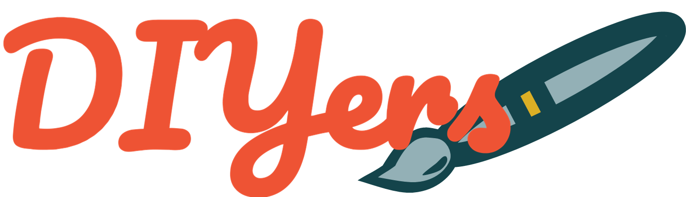
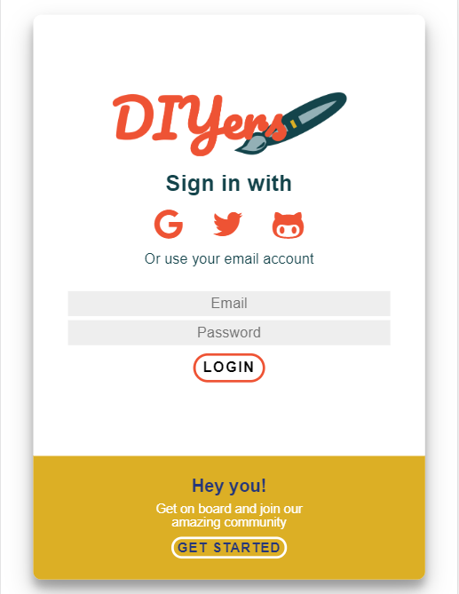
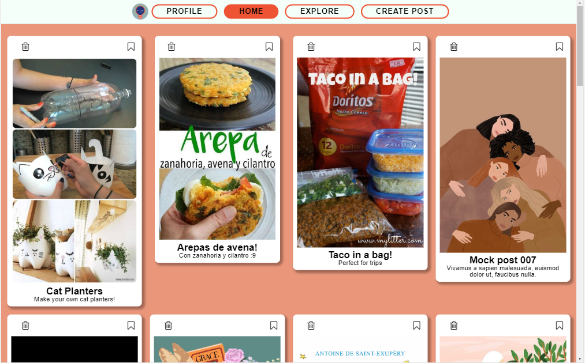

# DIYers
>The visual discovery engine for people who enjoy DIY.

## Index

* [1. Introduction](#1-introduction)
* [2. Overview / Motivation ](#2-overview-and-motivation)
* [3. User Stories](#3-user-stories)
* [4. Prototypes](#4-prototypes)
* [5. Finished Product](#5-finished-product)
* [6. Authors](#6-authors)
* [7. Acknowledgments](#7-acknowledgements)

***

## 1. Introduction
DIYers(ˌdiːˌaɪˈwaɪɚz) is a visual social network, whose main purpose is to help users discover recipes, crafting inspiration, home hacks and more ideas to try.

## 2. Overview and Motivation
### Who uses DIYers.

DIYers is developed for crafters of all ages, people who enjoy making and sharing their own stuff and learning how to make new projects.
It allows a step trough step follow trough, so you can make the project at your own pace.

### Key Features.
* Allows login or sign up with Google, Twitter or Github.
* Allows login or sign up with email adress and password.
* Lets you edit your profile data, such as screen name, about, country and profile picture.
* You can select the topics you're interested in.
* You can share your creations of any of your projects with all the users, or you can decide to share a private post that only you'll be able to see.
* It includes a 'feed', which shows you the posts of the topics you're interested in.
* You can see, update and delete a post you've made.
* You can change the privacy of a post you've made.
* You can select your favorite posts, and they will be saved on a tab in your profile.

### Motivation
DIYers was developed using MVC architecture, SPA and Mobile First design as the 3rd project of the Laboratoria Bootcamp in Guadalajara, Jalisco, México.
Our main motivations lays on our passion for crafting, creating and learning how to make new projects (and our love for Pinterest®, of course).

## 3. User Stories

1. As a new user, I should be able to create an account and login with a valid email and password.
    #### Acceptance Criteria
    > * It should be SPA and responsive.
    > * Shouldn't allow to create and account with an invalid email.
    > * Error messages should be visible.
    > * Should send you to profile info edit section after creating an account.
    > * When logging in, it should send you to feed.
    > * It should create a profile in the database with all the collected data.

2. As a new user, I should be able to login or create an account using Google, Twitter and Github without requiring a valid email.
    #### Acceptance Criteria
    > * It should be SPA and responsive.
    > * Should allow to create and account with a google acccount.
    > * Should allow to create and account with a twitter acccount.
    > * Should allow to create and account with a github acccount.
    > * Should allow to login with a google acccount.
    > * Should allow to login with a twitter acccount.
    > * Should allow to login with a github acccount.
    > * When logging in, it should send you to feed.
    > * Should send you to profile info edit section after creating an account.

3. As a logged user, I should be able to create, save and delete a private or public post in the same page (in place).
    #### Acceptance Criteria
    > * It should be SPA and responsive.
    > * Should allow to create a post with text and image.
    > * Should allow to select the privacy of the post.
    > * Post should require a title and description.
    > * Should allow the user to delete a post he created.
    > * Functionality shouldn't reload the page (in place).

4. As a logged user, I should be able to see all the posts I have created so far, from the latest to the oldest, as well as having the option to fave my own posts.
    #### Acceptance Criteria
    > * It should be SPA and responsive.
    > * It should allow to see all the user's posts.
    > * It should allow the user to fave his own posts.
    
5. As a logged user, I should be able to see all my favorite posts, as well as having the option to "unfav" them.   
    > * It should be SPA and responsive.
    > * It should allow to see the user's favorite posts.
    > * It should allow the user to remove the "favorite" mark on a post.

6. As a logged user, I should be able to access the social media, see my profile data and edit it.
    #### Acceptance Criteria
    > * It should be SPA and responsive.
    > * It should allow to see user profile data.
    > * It should allow to edit user profile data.
    

### Done Criteria for all Stories
* Fulfills acceptance criteria.
* Posess and passes test.
* Respects planned architecture.
* Code reviewed.
* Deployed.
* User tested*.
* Feedback requested and applied.

## 4. Prototypes

### Sketched Prototypes

 
 
 

### High Fidelity Prototypes
High fidelity Prototypes were made using Figma®. The color palette was created with Coolors.com 

Color Palette. 

Prototypes. 
 
 
 

## 5. Finished Product
Welcome Screen: 
  
Error Messages when logging in (examples of some): 
  
Feed View when logging in: 
  
Feed View on Web: 
  
Create Post page: 
  
Profile view: 
  
Edit profile view: 
  

## 6. Authors

- AryMF  
[Ary's Github](https://github.com/AryMF)  
Ary's email: ariadne.hp@gmail.com   
- Giovanna PC  
[Giov's Github](https://github.com/giovsteph) 
Giov's email: giov.ponce@gmail.com

## 7. Acknowledgments

* To the Laboratoria team, specially coach Frank.
* To Pinterest®, for the inspiration.
